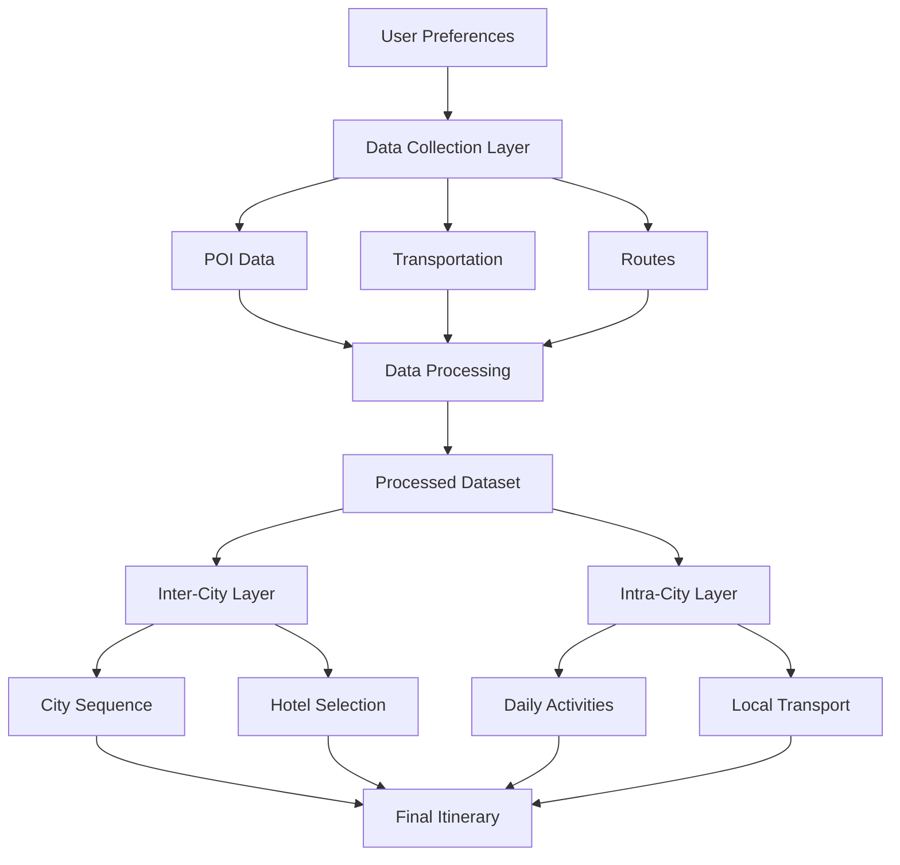
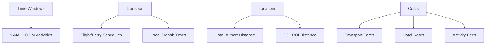
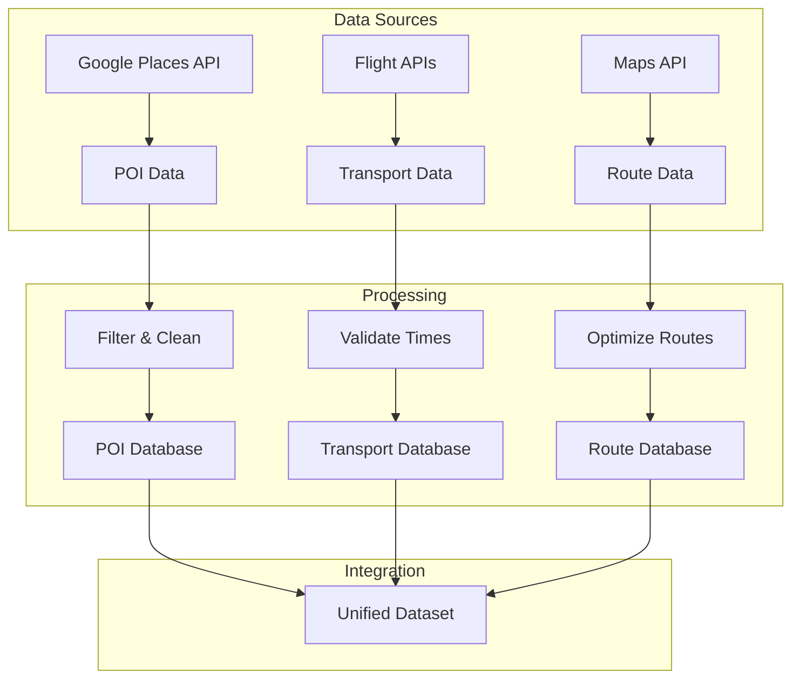
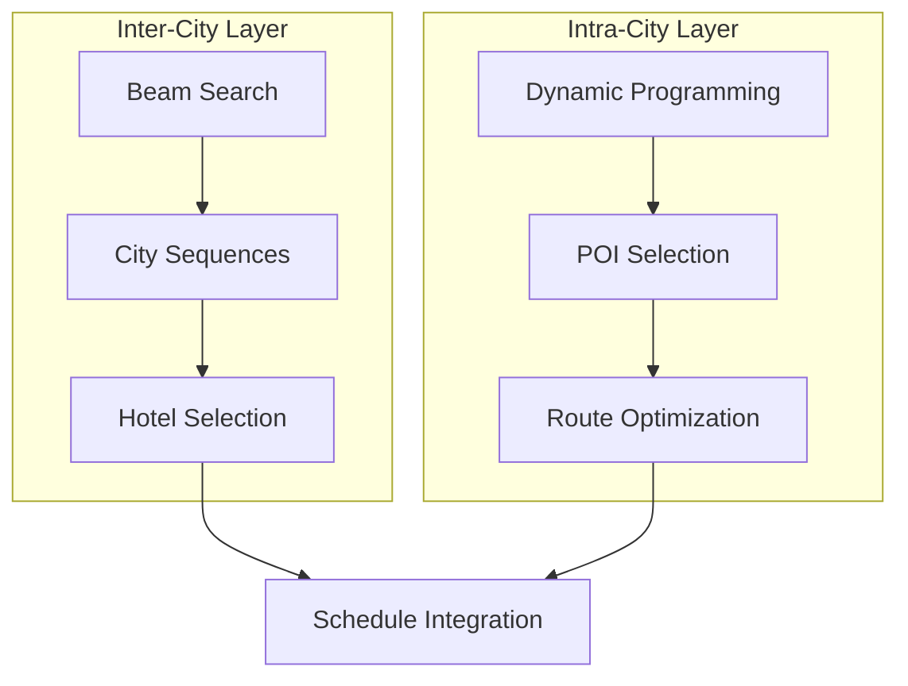
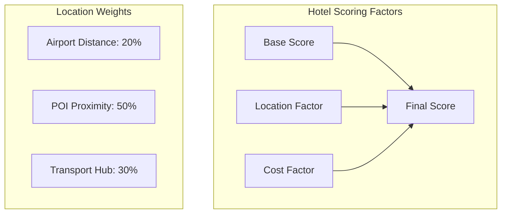
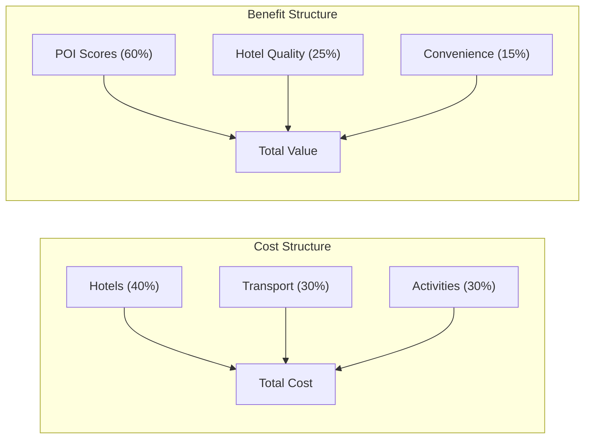
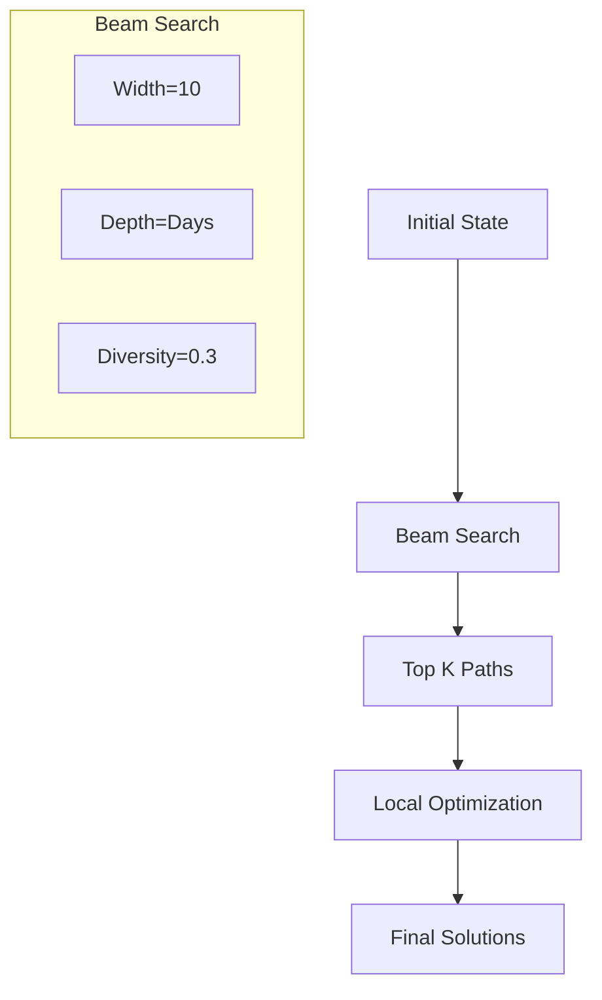
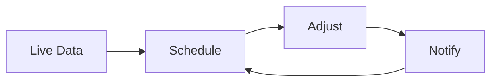

# Intelligent Trip Planner: A Two-Layer Optimization System

## Overview
An AI-powered trip planning system that creates optimized multi-city itineraries by solving a complex constraint satisfaction problem using a novel two-layer approach. The system transforms raw travel data into executable daily schedules while balancing user preferences, costs, and real-world constraints.

### System Flow


## Problem Definition

### The Challenge
Planning a multi-city trip involves solving multiple interconnected optimization problems:

1. **City Sequencing**: Determine optimal order of city visits
2. **Hotel Selection**: Choose strategic accommodation locations
3. **Activity Scheduling**: Plan daily POI visits within time windows
4. **Transportation Coordination**: Synchronize inter-city and local transport

### Real-World Constraints


## System Architecture

### 1. Data Collection & Processing (`Fetch_ALL.py`)


#### Example POI Data Structure:
```json
{
  "Acropolis": {
    "location": "Athens, Greece",
    "type": "attraction",
    "visit_duration": 180,
    "cost": 20.0,
    "preference_score": 50,
    "opening_hours": {
      "2025-06-14": {"open": "09:00", "close": "19:30"}
    }
  }
}
```

### 2. Trip Planning (`main_trip_planner.py`)


#### Example Beam Search State:
```python
state = {
    'current_day': 2,
    'city_sequence': ['Athens', 'Santorini'],
    'hotels_used': ['Grand Hyatt Athens', 'Acro Suites'],
    'objective_score': 687.77,
    'total_cost': 4912.62,
    'visited_pois': ['Acropolis', 'Ancient Agora', ...]
}
```

## Key Innovations

### 1. Adaptive Time Windows
```
Regular Day:          |--------------------| 
                     09:00              22:00

Travel Day:          |------||====||------|
                     09:00  14:00  16:00  22:00
                     Morning Flight Evening

Last Day:            |------||====|
                     09:00  11:00  12:00
                     Morning Checkout
```

### 2. Smart Hotel Selection


### 3. Dynamic Schedule Adjustment
```
Morning Schedule Compression:
Before: 09:00-12:00 Ancient Agora
        12:00-15:00 Acropolis
After:  09:00-11:00 Ancient Agora
        11:15-13:45 Acropolis
        14:00      Flight to Santorini
```

## Results Analysis

### 1. Solution Quality Metrics
```
Preference Score Distribution:
650-700   ██████████ 40%
700-750   ████████   30%
750-800   ████      15%
600-650   ████      15%

Time Utilization:
Active    ████████████████ 80%
Transit   ████           20%
Unused    █              5%
```

### 2. Cost-Benefit Analysis


### 3. Example Solution
```
Day 1: Athens
┌─ 12:00 Airport Arrival
├─ 12:30 Hotel Check-in
├─ 13:30 Ancient Agora
├─ 15:30 Acropolis
└─ 19:00 Dinner & Evening Activities

Day 2: Athens → Santorini
┌─ 09:00 Morning Activities
├─ 14:00 Flight to Santorini
├─ 16:00 Hotel Check-in
└─ 17:00 Evening in Oia

Day 3: Santorini
┌─ 09:00 Beach Activities
├─ 14:00 Wine Tasting
└─ 18:00 Sunset Dinner
```

## Implementation Details

### 1. Constraint Handling
```python
# Example: Transportation timing validation
def validate_transport(transport, hotel):
    # Calculate actual departure time
    hotel_to_hub = get_travel_time(hotel, transport.hub)
    departure = transport.time - hotel_to_hub - BUFFER
    
    # Check feasibility
    return (
        departure >= TIME_WINDOW.start and
        arrival <= TIME_WINDOW.end and
        has_valid_connection()
    )
```

### 2. Optimization Strategy


## Future Work

### 1. Real-time Updates


### 2. ML Integration
- Preference learning from user feedback
- Dynamic pricing prediction
- Crowd level estimation

### 3. Interactive Planning
- Real-time schedule modifications
- Alternative suggestions
- Group coordination

## Usage Guide

### Setup
```bash
# Clone repository
git clone https://github.com/your-repo/trip-planner.git

# Install dependencies
pip install -r requirements.txt

# Configure API keys
cp .env.example .env
# Edit .env with your API keys
```

### Running the System
```bash
# 1. Fetch data
python Fetch_ALL.py

# 2. Generate plans
python main_trip_planner.py

# 3. View results
open trip_planner_output/
```

## References
1. Beam Search Optimization in Travel Planning
2. Constraint Satisfaction in Tourism
3. Multi-objective Optimization for Itinerary Design
4. Real-time Transportation Scheduling 
